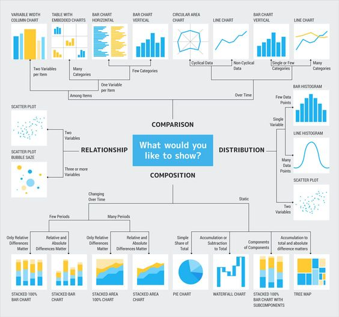
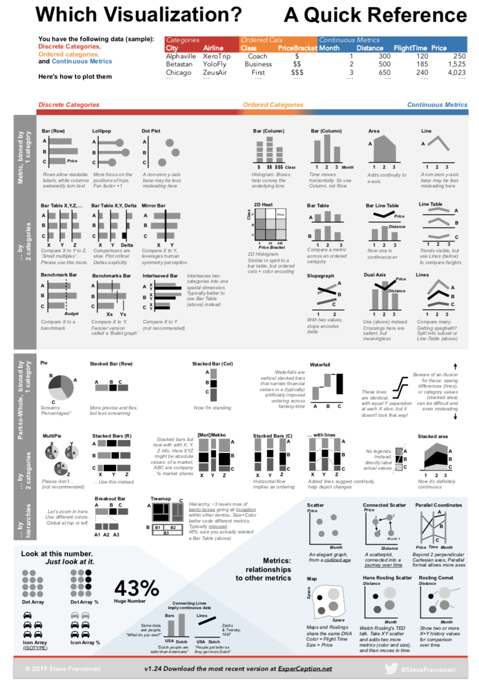

# Visualisation

## At a glance

[From data to viz](https://www.data-to-viz.com/)

[The data visualisation catalogue](https://datavizcatalogue.com/)

[Multiple views on how to choose a visualization](https://medium.com/multiple-views-visualization-research-explained/multiple-views-on-how-to-choose-a-visualization-b3ffc99fcddc)

[Visualisation Graphic Continuum](https://policyviz.com/2014/09/09/graphic-continuum/)

[Visual Vocabulary: Designing with Data](https://ft-interactive.github.io/visual-vocabulary/)

[Choosing a chart](https://github.com/widged/data-for-good/wiki/Visualisation-::-Choosing-a-chart)

[The way of data visualisation](https://www.behance.net/gallery/65929627/1805-Data-Visualization-Infographic-Poster)

## Detailed learning tutorials

[What makes a data visualization memorable?](http://www.seas.harvard.edu/news/2013/10/what-makes-data-visualization-memorable)

[A Tour Through the Visualization Zoo](https://homes.cs.washington.edu/~jheer/files/zoo/)

[Visualization Design according to Munzner’s Model](https://ekipa2blog.wordpress.com/2016/04/17/visualization-design-according-to-munzners-model/)

[Visualization Analysis and Design I - Tamara Munzner](https://www.youtube.com/watch?v=IKSRwGZe8Oc) (youtube video)

[Fundamentals of Data Visualization](https://clauswilke.com/dataviz/). The website contains the complete author manuscript before final copy-editing and other quality control.

## Sites with sandboxes and code easy to fork

[observablehq](https://observablehq.com/@widged)

[bl.ocks](http://bl.ocks.org/)

[codepen-d3](https://codepen.io/search/pens?q=d3)

[codepen-d3](https://codepen.io/search/pens?q=d3)

[codepen-chart](https://codepen.io/search/pens?q=chart)

## Data types

### Percentages

[Visualizing Percentages 20 Ways](https://infonewt.com/percentages)

### Time series

[time-series](https://clauswilke.com/dataviz/time-series.html)
